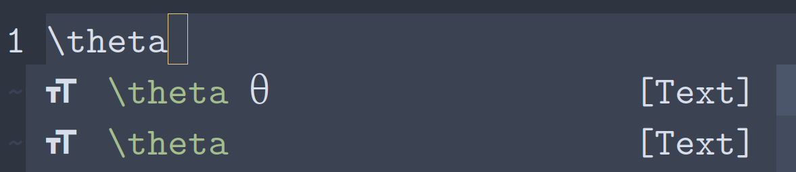

# Preview


# Introduction

nvim-cmp Lua LaTeX Symbols is a completion source for
[nvim-cmp](https://github.com/hrsh7th/nvim-cmp) that provides sources for LaTeX
symbols. This is especially useful for editing
[TeX](#only-for-certain-file-types) file types. It gets them from this URL:
https://milde.users.sourceforge.net/LUCR/Math/data/unimathsymbols.txt. *The
purpose of this plugin is to provide a 100% Lua alternative to
[cmp-latex-symbols](https://github.com/kdheepak/cmp-latex-symbols).*
cmp-latex-symbols uses Julia code to generate the symbols list, whereas this
plugin sticks to Lua instead.

# Installation

## [packer.nvim](https://github.com/wbthomason/packer.nvim)

``` lua
require "packer".startup(function(use)
	use "amarakon/nvim-cmp-lua-latex-symbols"
end)
```

# Setup

``` lua
require "cmp".setup {
	sources = {
		{ name = "lua-latex-symbols" }
	}
}
```

## Only for certain file types

``` lua
-- Only enable `lua-latex-symbols` for `tex` and `plaintex` file types
require "cmp".setup.filetype({ "tex", "plaintex" }, {
	sources = {
		{ name = "lua-latex-symbols"}
	}
})
```

# Issues

- The text file used to parse the symbols is really large. Also, the code has to
  loop through each line of the file, then loop through each section, and check
  if the symbol is valid. This takes a long time. I plan to add a cache feature
  to this plugin in the future.

- There are certain instances where you will see two different symbols with the
  same name. Most of the time, only the first symbol is useful. I plan to remove
  duplicates in the future.

  
